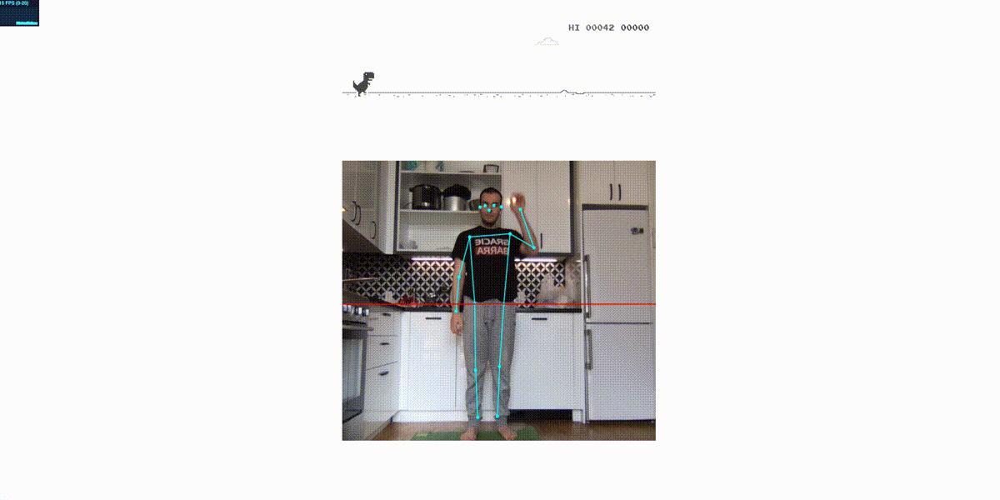

# T-Rex PoseNet

Control T-Rex runner with your bod. Put together with help of [@aarora08](https://github.com/aarora08). Implemented on top of the demo provided by PoseNet tensorflow js. 




### Setup:

```bash
git clone git@github.com:Denisolt/trex-posenet.git
cd trex-posenet

# run yarn
yarn
yarn watch
```


### How to play:

- Make sure you stand far away from the camera to capture full body. 
- Raise you right arm next to your head, to create a hip line. 
- Jump to start


## License

Distributed under the Apache-2.0 License. See `LICENSE` for more information.


## Acknowledgements

- [@aarora08](https://github.com/aarora08)
- [@wayou](https://github.com/wayou)
- [TensorFlow PoseNet demo](https://github.com/tensorflow/tfjs-models/tree/master/posenet)
